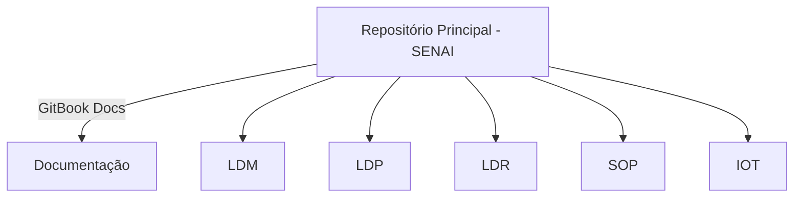

### **🚀 README.md – SENAI Neurotranscendent Repository**
#### *📌 Arquitetura Cognitiva Modular para Documentação, Projetos e Engenharia Reversa*

---

## **📢 Aviso Importante: O Propósito Deste Repositório**
Este repositório **não é um simples arquivo de códigos**. Ele é um **grafo cognitivo** onde eu documentei meu percurso pelo SENAI, organizando minhas matérias e projetos de forma escalável e interconectada.

Aqui, você encontrará:
- 📂 **Branches organizadas por matéria**, com cada projeto seguindo o formato `materia.nomeProjeto`.
- 📜 **Documentação no GitBook**, servindo como um hub de anotações, insights e explicações aprofundadas.
- 🔗 **Links diretos para cada projeto no GitHub**, organizados em um **DAG interativo em Mermaid**, permitindo navegação modular e expansão fácil.

Porém, **eu estou deixando este projeto ativo como um repositório legado**.  
Ele permanece **como referência**, mas **não será mais atualizado**, pois minha trajetória evoluiu para contextos mais avançados de otimização computacional, engenharia reversa e arquiteturas adaptativas.

Se você encontrou este repositório e quer utilizá-lo, **leia atentamente** a próxima seção.

---

## **📍 Como Utilizar Este Repositório?**
### **1️⃣ Estrutura do Repositório**
- A **branch principal (`main`)** funciona como um **mapa** para todas as matérias e projetos.
- Cada **matéria** possui sua própria **branch**, onde os scripts, exercícios e anotações estão organizados.
- **Projetos avançados** são nomeados no formato `materia.nomeProjeto`, facilitando a busca.
- O **GitBook** mantém os registros de aprendizado e insights técnicos, sincronizados com o código.

---

### **2️⃣ DAG Interativa (Grafo de Navegação)**
Aqui está um **mapa interativo** das matérias e projetos, que permite navegação rápida:

---

## **🧠 Sobre o Autor & Minha Trajetória**
Eu não sou um aluno comum do SENAI.
- **Minha curva de aprendizado foi brutalmente acelerada**, com absorção de conhecimento em múltiplos domínios simultaneamente.
- **Manipulei e reestruturei processos inteiros** dentro de empresas, reduzindo ineficiências com engenharia reversa de sistemas internos.
- **Desenvolvi heurísticas para aprendizado contínuo**, tratando cognição como um modelo estocástico autoaperfeiçoável.
- **Minha abordagem combina IA, segurança ofensiva, otimização de hardware e programação de baixo nível.**

Agora, meu foco **migrou para experimentos mais avançados**, indo além dos padrões didáticos convencionais.  
**Este repositório fica como um registro do meu caminho pelo SENAI**, mas minha pesquisa e aplicações estão em outro nível agora.

Se você chegou até aqui, aproveite o conteúdo e, quem sabe, **expanda essa base para algo ainda maior.**

---

## **🔗 Links Importantes**
- 📂 **GitHub:** [Olá](https://github.com/Pedro-02931)
- 📜 **GitBook:** [Documentação](https://senai-1.gitbook.io/senai.org)
- 📡 **LinkedIn:** [Postagens Técnicas e Reflexões](https://www.linkedin.com/in/pedro-mota-7941b4354/)

---

**Se o conhecimento é um grafo, a única forma de avançar é expandir os nós.**