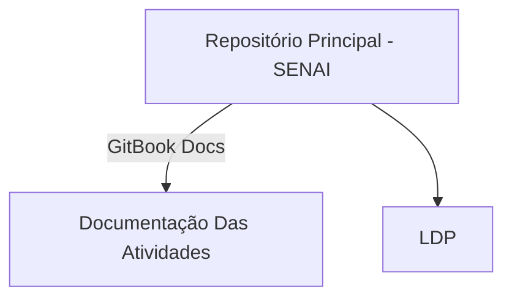

# **📌 Estrutura do Código e Conceitos Aplicados**

## **🛠️ Arquitetura e Design Patterns**
O projeto foi estruturado utilizando os seguintes conceitos de **Design e Arquitetura de Software**:

- **Programação Orientada a Objetos (OOP)**
- **Modelo MVC Simplificado**
- **Validação e Tratamento de Exceções** 
- **Leitura de Dados Eficiente**  
- **Uso de `final` para Imutabilidade** 
- **Cálculo Otimizado**  

---

## **📁 Estrutura de Diretórios**

```
src/
└── main/
    └── java/
        └── main.senai.com.calcularPoligonos/
            ├── Main.java
            ├── model/
            │   ├── Shape.java
            │   ├── Circle.java
            │   ├── Rectangle.java
            │   ├── Square.java
            │   ├── Triangle.java
            │   ├── Trapezoid.java
```

📌 **Explicação da estrutura:**  
- `Main.java` – Gerencia a interface do usuário, input de dados e controle de fluxo.  
- `model/` – Contém todas as classes de formas geométricas e a classe abstrata `Shape`.  

---

## **Explicação dos Conceitos Usados**

### **1️⃣ Por que `BufferedReader` em vez de `Scanner`?**
📌 **Scanner**: Usa parsing interno + regex para dividir entradas, gerando overhead.  
📌 **BufferedReader**: Lê texto como stream contínuo, evitando parsing desnecessário.  

---

### **2️⃣ Por que `final` nos atributos das classes?**
📌 `final` impede que valores sejam modificados após a inicialização, permitindo otimizações como:
- Redução de chamadas desnecessárias ao GC.
- Melhoria na previsibilidade do comportamento da CPU (branch prediction eficiente).
- Segurança contra reatribuições acidentais.

---

### **3️⃣ Por que usar constantes pré-calculadas?**
Exemplo:  

```java
private static final double AREA_CONSTANT = Math.sqrt(3) * 0.25;
```
📌 Essa constante é usada para calcular a área do triângulo sem precisar **recalcular `sqrt(3) / 4` toda vez**.  
Isso **reduz operações na FPU** e **economiza ciclos de CPU**.   

---




---

## **🔗 Links Importantes**
- 📂 **GitHub:** [Olá](https://github.com/Pedro-02931)
- 📡 **LinkedIn:** [Postagens Técnicas e Reflexões](https://www.linkedin.com/in/pedro-mota-7941b4354/)

---

