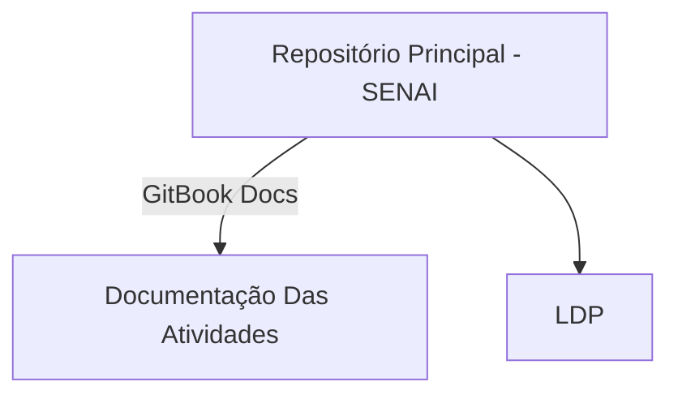

# O que é esse app:

- Aplicativo de consulta criado sobre a supervisão do professor [Celso Furtado](https://www.linkedin.com/in/celso-furtado-803713aa/) na turma de desenvolvimento de sistema 2025 no SENAI de Jandira.
- O objetivo é aprender conceitos de orientação a objetos.

## **🔗 Links Importantes**
- 📂 **GitHub:** [Olá](https://github.com/Pedro-02931)
- 📜 **GitBook:** [Documentação Especifica do Projeto](https://senai-1.gitbook.io/senai.org/tarefas-senai/lop/clinica-app)
- 📡 **LinkedIn:** [Postagens Técnicas e Reflexões](https://www.linkedin.com/in/pedro-mota-7941b4354/)