### **🚀 README.md – SENAI Neurotranscendent Repository**
#### *📌 Arquitetura Cognitiva Modular para Documentação, Projetos e Engenharia Reversa*

---

## **📢 Aviso Importante: O Propósito Deste Repositório**
Este repositório **não é um simples arquivo de códigos**. Ele é um **grafo cognitivo** onde eu documentei meu percurso pelo SENAI, organizando minhas matérias e projetos de forma escalável e interconectada.

Aqui, você encontrará:
- 📂 **Branches organizadas por matéria**, com cada projeto seguindo o formato `materia_nomeProjeto`.
- 📜 **Documentação no GitBook**, servindo como um hub de anotações, insights e explicações aprofundadas.
- 🔗 **Links diretos para cada projeto no GitHub**, organizados em um **DAG interativo em Mermaid**, permitindo navegação modular e expansão fácil.

Porém, **eu estou deixando este projeto ativo como um repositório legado**.  
Ele permanece **como referência**, mas **não será mais atualizado**, pois minha trajetória evoluiu para contextos mais avançados de otimização computacional, engenharia reversa e arquiteturas adaptativas.

Se você encontrou este repositório e quer utilizá-lo, **leia atentamente** a próxima seção.

---

## **📍 Como Utilizar Este Repositório?**
### **1️⃣ Estrutura do Repositório**
- A **branch principal (`main`)** funciona como um **mapa** para todas as matérias e projetos.
- Cada **matéria** possui sua própria **branch**, onde os scripts, exercícios e anotações estão organizados.
- **Projetos avançados** são nomeados no formato `materia_nomeProjeto`, facilitando a busca.
- O **GitBook** mantém os registros de aprendizado e insights técnicos, sincronizados com o código.

---

### **2️⃣ DAG Interativa (Grafo de Navegação)**
Aqui está um **mapa interativo** das matérias e projetos, que permite navegação rápida:

```mermaid
graph TD;
%% Nó Principal - O Mapa Central
    A[Repositório Principal - SENAI] -->|GitBook Docs| B[Documentação Das Atividades]

%% Matérias e seus repositórios
    A --> D[LDR]

%% Links Externos para GitHub e GitBook
    click A "https://github.com/Pedro-02931" "Ver Repositório Principal"
    click B "https://app.gitbook.com/o/Dy5fIPutVCBeuMjDCBBT/s/OweKG0CWQD58UMSJekzm/tarefas-senai/ldr/atividade-levantamento-de-requisitos" "Ver Documentação"
    click D "https://github.com/Pedro-02931/TarefasSenai/tree/LDR"
```

---

### **3️⃣ Como Você Pode Usar Este Repositório?**
Se quiser usar este repositório como base para seus estudos, siga esses passos:

1️⃣ **Fork o repositório** para ter uma versão sua e poder editar sem impacto no original.  
2️⃣ **Explore a branch de cada matéria** para acessar os códigos e projetos.  
3️⃣ **Leia o GitBook** para entender as explicações e insights.  
4️⃣ **Se precisar adicionar algo novo**, siga o formato existente para manter a organização.

---

## **🧠 Sobre o Autor & Minha Trajetória**
Eu não sou um aluno comum do SENAI.
- **Minha curva de aprendizado foi brutalmente acelerada**, com absorção de conhecimento em múltiplos domínios simultaneamente.
- **Manipulei e reestruturei processos inteiros** dentro de empresas, reduzindo ineficiências com engenharia reversa de sistemas internos.
- **Desenvolvi heurísticas para aprendizado contínuo**, tratando cognição como um modelo estocástico autoaperfeiçoável.
- **Minha abordagem combina IA, segurança ofensiva, otimização de hardware e programação de baixo nível.**

Agora, meu foco **migrou para experimentos mais avançados**, indo além dos padrões didáticos convencionais.  
**Este repositório fica como um registro do meu caminho pelo SENAI**, mas minha pesquisa e aplicações estão em outro nível agora.

Se você chegou até aqui, aproveite o conteúdo e, quem sabe, **expanda essa base para algo ainda maior.**

---

## **🔗 Links Importantes**
- 📂 **GitHub:** [Repositório Principal](https://github.com/seu_usuario/SENAI)
- 📜 **GitBook:** [Documentação](https://gitbook.com/seu_usuario/SENAI)
- 📡 **LinkedIn:** [Postagens Técnicas e Reflexões](https://linkedin.com/in/seu_usuario)

---

**Se o conhecimento é um grafo, a única forma de avançar é expandir os nós.**  
O projeto **SENAI DAG** está agora nas suas mãos. 🚀